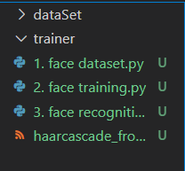

# face_recognition-
in your vscode terminal:
pip install opencv-contrib-python

other than this you also have to create 2 other files: 

1)dataSet
2)trainer 

it should look something like this:

NOTE: try and keep the Raspberrypi's temperature below 47C, works the best.

NOTE2: you also have to have a composer, php v 7(NOT version 8), and firebase admin sdk 4x (NOT 5x)
